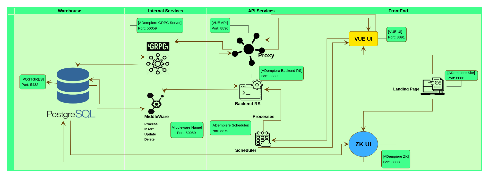
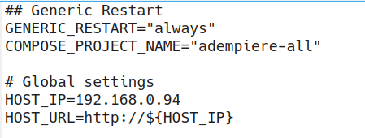

# ADempiere All Services
This application downloads the required images, runs the configured containers, restores the database if needed on your local machine just by calling a script!
 
It consists of a *docker compose* project that defines all services needed to run ADempiere on ZK and Vue. 
 
When executed, the *docker compose* project eventually runs the services defined in file *docker-compose.yml* as Docker containers.
The running Docker containers comprise the application.
 
Benefits of the application:
- It can run on different environments just by changing the target (i.e. host) IP.
- It can be run for different customers on the same host by just changing the project name and running anew.
- The desired values are changed only at one single configuration file.
- Single containers or images can be updated and/or replaced easily.
- The timezone and location for all containers are the same as the hosts'.
- Ideal for testing situations due to its ease of configuration and execution.
- No need of deep knowledge of Docker, Images or Postgres.

## Example of Application Running


## General Explanations
### User's perspective
From a user's point of view, the application consists of the following.
Beware that the ports are defined in file *env_template*.
- A home web site accesible via port **8080**
  From which all applications can be called
- An ADempiere ZK UI accesible via port **8888**
- An ADempiere Vue UI accesible via port **8891**
- A Postgres databasee accesible e.g. by PGAdmin via port **55432**

### Application Stack
The application stack consists of the following services defined in *docker-compose.yml*, which eventually will be run as containers:
- *adempiere-site*: defines the landing page (web site) for this application
- *adempiere.db*: defines the Postgres database 
- *adempiere-zk*: defines the Jetty server and the ADempiere ZK UI
- *adempiere-middleware*: manages Database Insert, Update, Delete 
- *adempiere-backend-rs*:
- *adempiere-grpc-server*: defines the backend server for Vue
- *adempiere-scheduler*: for processes that are executed outside Adempiere
- *vue-api*: proxy
- *vue-ui*: defines ADempiere Vue UI

Additional objects defined in *docker-compose.yml*:
- *adempiere_network*: defines the subnet used in the involved Docker containers (e.g. **192.168.100.0/24**)
- *volume_postgres*: defines the mounting point of the Postgres database (typically directory **/var/lib/postgresql/data**) to a local directory on the host where the Docker container runs.
- *volume_backups*: defines the mounting point of a backup directory on the Docker container to a local directrory on the host where the Docker container runs.
- *volume_scheduler*: defines the mounting point for the scheduler

### Architecture
The application stack as graphic:


### File Structure
- *README.md*: this very file
- *docker-compose.yml*: the docker compose definition file. Here are defined all services.
  Variables used in this file are taken from file *.env*.
- *.env*: definition of all variables used in *docker-compose.yml*.
- *env_template*: template for definition of all variables. Usually, this file is edited and tested before copied to *.env*.
- *start-all.sh*: shell script to automatically execute docker compose.
- *stop-and-delete-all.sh*: shell script to delete all containers, images, networks and volumnes created with *start-all.sh*
- *postgresql/Dockerfile*: the Dockerfile used.
- *postgresql/initdb.sh*: shell script executed when Postgres starts. It launches a restore database when there is no database and a backup exists.
- *postgresql/postgres_database*: mounting point on the host for the Postgres container's database. This makes sure that the database is not deleted even if the docker containers, docker images and even docker are deleted.
- *postgresql/backups*: the mounting point for the backups/restores from the Postgres container.
- *docs*: directory containing images and documents used in this README file.

## Installation
### Requirements
##### 1 Install Tools
Make sure to install the following:
- JDK  11
- Docker
- Docker compose: [Docker Compose v2.16.0 or later](https://docs.docker.com/compose/install/linux/)
- Git

##### 2 Check versions
2.1 Check `java version`
```Shell
java --version
    openjdk 11.0.11 2021-04-20
    OpenJDK Runtime Environment AdoptOpenJDK-11.0.11+9 (build 11.0.11+9)
    OpenJDK 64-Bit Server VM AdoptOpenJDK-11.0.11+9 (build 11.0.11+9, mixed mode
```
2.2 Check `docker version`
```Shell
docker --version
    Docker version 23.0.3, build 3e7cbfd
```
2.3 Check `docker compose version`
```Shell
docker compose version
    Docker Compose version v2.17.2
```
### Clone This Repository
```Shell
git clone https://github.com/SusanneCalderon/adempiere-all-services
cd adempiere-all-services
```
### Make sure to use correct branch
```Shell
git checkout feature/shw/local-seed/master
```

### Manual Execution
Alternative to **Automatic Execution**.
Recommendable for the first installation.
##### Create the directory on the host where the database will be mounted
```Shell
mkdir postgresql/postgres_database
```
##### Create the directory on the host where the backups will be mounted
```Shell
mkdir postgresql/backups
```
##### Copy backup file (if restore is needed)
- If you are executing this project for the first time or you want to restore the database, execute a database backup e.g.: 
`pg_dump -v --no-owner -h localhost -U postgres <DB-NAME> > adempiere-$(date '+%Y-%m-%d').backup`. 
- The file must be named `seed.backup` or as it was defined in *postgresql/initdb.sh*. Then, copy or move it to `adempiere-all-service/postgresql/backups`. 
- Make sure it is not the compressed backup (e.g. .jar).
- The database directory `adempiere-all-service/postgresql/postgres_database` must be empty for the restore to ocurr. The backup will not ocurr if the database directory has contents.
```Shell
cp <PATH-TO-BACKUP-FILE> postgresql/backups
```
##### Modify env_template as needed
The only variables actually needed to change are *COMPOSE_PROJECT_NAME* (to the name you want to give the project, e.g. the name of your client) and *HOST_IP* (to the IP your host has).


Other values in *env_template* are default values. 
Feel free to change them accordingly to your wishes/purposes.
There should be no need to change file *docker-compose.yml*.
##### Copy env_template if it was modified
Once you modified *env_template* as needed, copy it to *.env*. This is not needed if you run *start-all.sh*. 
```Shell
cp env_template .env
```
##### File initdb.sh (optional)
Modify `postgresql/initdb.sh` as necessary, depending on the backup file you are using. 
A different restore command might be needed in *postgresql/initdb.sh* depending on the way the backup was done (*RUN_DBExport.sh* or *pg_dump*).
##### Execute docker compose
Run `docker compose`
```Shell
docker compose up -d
```

**Result: all images are downloaded, containers and other docker objects created, containers are started, and database restored**.

This might take some time, depending on your bandwith and the size of the restore file.
### Automatic Execution
Alternative to **Manual Execution**.
Recommendable when docker compose was run before.

Execute script `start-all.sh`:
```Shell
./start-all.sh
```
The script *start-all.sh* carries out the steps of the manual installation.
If directories *postgresql/postgres_database* and *postgresql/backups* do not exist, they are created.

If 
- there is a file *seed.backup* in *postgresql/backups*, and 
- the database as specified in *postgresql/initdb.sh* does not exist in Postgres, and
- directory *postgresql/postgres_database* has no contents

**The database  will be restored**.

If directory *postgresql/postgres_database* has contents, no restore will be executed (actually, *postgresql/initdb.sh* will be ignored).


**Result: all images are downloaded, containers and other docker objects created, containers are started, and -depending on conditions explained before- database restored**.

This might take some time, depending on your bandwith and the size of the restore file.
## Open Applications
- Project site: open browser and type in the following url [http://localhost:8080](http://localhost:8080)

  From here, the user can navigate via buttons to ZK UI or Vue UI.
- Open separately Adempiere ZK: open browser and type in the following url [http://localhost:8888/webui](http://localhost:8888/webui)
- Open separately Adempiere Vue:open browser and type in the following url [http://localhost:8891/#/login?redirect=%2Fdashboard](http://localhost:8891/#/login?redirect=%2Fdashboard)

### Delete All Docker Objects
Sometimes, due to different reasons, you need to undo everything and start anew.

Then, 
- All Docker containers must be shut down.
- All Docker containers must be deleted.
- All Docker images must be deleted.
- The Docker installation cache must be cleared.
- All Docker networks and volumes must be deleted.

Execute command:
```Shell
./stop-and-delete-all.sh
```

### Access to Database
Connect via port **55432** with a DB connector, e.g. PGAdmin.
Or to the port the variable *POSTGRES_EXTERNAL_PORT* points in file *env_template*.

## Useful Commands
### Container Management
##### Shut down all containers
  The database will be preserved.
  All docker images, networks, and volumes will be preserved.
```Shell
docker compose down
```
##### Stop and delete one service (services defined in *docker-compose.yml*)
```Shell
docker compose rm -s -f <service name>
docker compose rm -s -f adempiere.db
docker compose rm -s -f adempiere-zk
etc.
```
##### Stop and delete all services
```Shell
docker compose rm -s -f
```
##### Create and restart all services
```Shell
docker compose up -d
```
##### Stop one single service
```Shell
docker compose stop <service name>
docker compose stop adempiere-site
etc.
```
##### Start one single service (after it was stopped)
```Shell
docker compose start <service name>
docker compose start adempiere-site
etc.
```
##### Start and stop one single service
```Shell
docker compose restart <service name>
docker compose restart adempiere-site
etc.
```
##### Find containers and services
```Shell
docker compose ps -a
```

### Misc Commands
##### Display all docker images
```Shell
docker images -a
```

##### Display all docker containers
```Shell
docker ps -a
docker ps -a --format "{{.ID}}: {{.Names}}"
```

##### Physically delete database via Docker notation from the host.
  Be careful with these commands, once done, there is no way to undo it!
  Smetimes it is needed to delete all files that comprises the database.
  The database directory must be empty for the restore to work.
```Shell
sudo ls -al /var/lib/docker/volumes/<POSTGRES_VOLUME>              -->> variable defined in *env_template*
sudo ls -al /var/lib/docker/volumes/adempiere-all.volume_postgres  -->> default value

sudo rm -rf /var/lib/docker/volumes/<POSTGRES_VOLUME>/_data
sudo rm -rf /var/lib/docker/volumes/adempiere-all.volume_postgres/_data
```

##### Physically delete database via mounted volumes from the host.
  Be careful with these commands, once done, there is no way to undo it!
  Smetimes it is needed to delete all files that comprises the database.
  The database directory must be empty for the restore to work.
```Shell
sudo ls -al <POSTGRES_DB_PATH_ON_HOST>                         -->> variable defined in *env_template*
sudo ls -al <PATH TO REPOSITORY>/postgresql/postgres_database  -->> default value

sudo rm -rf <POSTGRES_DB_PATH_ON_HOST>
sudo rm -rf <PATH TO REPOSITORY>/postgresql/postgres_database
```


##### Debug: display logs of a container
```Shell
docker container logs <CONTAINER>                         -->> variable defined in *env_template*
docker container logs <CONTAINER> | less                  -->> variable defined in *env_template*
docker container logs adempiere-all.postgres.database
docker container logs adempiere-all.postgres.database | less

```

##### Log into a container
```Shell
docker container exec -it <CONTAINER> <COMMAND>                
docker container exec -it adempiere-all.postgres.database bash
etc.

```

